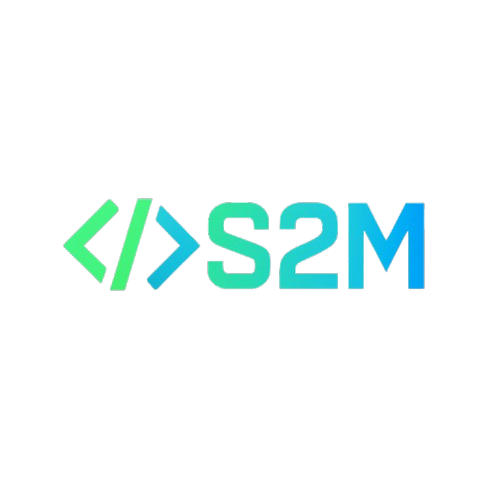

# 🔄 S2M - Solidity to Move Transpiler

[](LICENSE)

<div align="center">
  
</div>

A powerful monorepo-based toolchain that transpiles Solidity smart contracts into Move-compatible modules on **Sui** blockchains. Supports advanced type mapping, modular imports, dynamic Move project integration, and AI-assisted fallback for complex constructs.

## 📚 Table of Contents

- [📁 Project Structure](#-project-structure)
- [🚀 Features](#-features)
- [🧠 AI Integration](#-ai-integration)
- [🛠️ Installation](#️-installation)
- [💻 Usage](#-usage)

  - [CLI (Local Development)](#cli-local-development)
  - [Web App (File Upload)](#web-app-file-upload)

- [🔬 Move Code Generation](#-move-code-generation)
- [📦 Example Input → Output](#-example-input--output)
- [🧪 Tests & Linting](#-tests--linting)
- [🔗 Contribution Guide](#-contribution-guide)
- [📌 Roadmap](#-roadmap)
- [📜 License](#-license)

---

## 📁 Project Structure

```
S2M/
├── README.md
├── package.json
├── tsconfig.json
├── transpiler.config.json      # Optional config file
│
├── core/
│   ├── src/
│   │   ├── abi/
│   │   │   ├── abiParser.ts
│   │   │   ├── solidityAstParser.ts
│   │   │   └── abiDocGenerator.ts
│   │   │
│   │   ├── move/
│   │   │   ├── importMapper.ts
│   │   │   ├── typeMapper.ts
│   │   │   ├── targetMapper.ts
│   │   │   ├── moveGenerator.ts
│   │   │   ├── generators/
│   │   │   │   ├── functionGenerator.ts
│   │   │   │   ├── eventGenerator.ts
│   │   │   │   ├── mappingGenerator.ts
│   │   │   │   └── errorGenerator.ts
│   │   │   └── ast.ts
│   │   │
│   │   ├── plugin/
│   │   │   ├── pluginManager.ts
│   │   │   └── advancedSyntaxPlugin.ts
│   │   │
│   │   ├── utils/
│   │   │   ├── logger.ts
│   │   │   ├── utils.ts
│   │   │   └── configLoader.ts
│   │   │
│   │   ├── types.ts
│   │   ├── config.ts
│   │   └── tomlUpdater.ts
│   │
│   └── tests/
│       ├── abiParser.test.ts
│       ├── moveGenerator.test.ts
│       └── typeMapper.test.ts
│
├── cli/
│   ├── src/
│   │   ├── cli.ts
│   │   ├── index.ts
│   │   └── fileWriter.ts
│   └── dist/                 # Compiled CLI output
│
├── web/
│   ├── backend/
│   │   ├── src/
│   │   │   ├── app.ts
│   │   │   ├── routes/
│   │   │   │   └── transpile.ts
│   │   │   └── types.ts
│   │   └── dist/             # Compiled backend output
│   │
│   ├── frontend/
│   │   ├── public/
│   │   │   └── assets/
│   │   │       └── S2M.png
│   │   ├── src/
│   │   │   ├── components/
│   │   │   │   └── FileUploader.tsx
│   │   │   ├── App.tsx
│   │   │   └── main.tsx
│   │   ├── index.html
│   │   └── vite.config.ts
│   │
└── docs/
    ├── design.md
    └── .placeholder
```

---

## 🚀 Features

| Feature                      | Description                                                      |
| ---------------------------- | ---------------------------------------------------------------- |
| ✅ Solidity Parsing          | Parse `.sol` files and generate Move from function bodies        |
| ✅ ABI Support               | Generate Move from standard `.abi.json`                          |
| 🔁 Framework Abstraction     | Target `sui` or `aptos` Move dialects [Focus SUI]                |
| 🧱 AST-Based Move Generation | Structured Move module builder using AST                         |
| 🎯 Type Mapping              | `uint`, `address`, `string`, `mapping(...) → Table::Table<_, _>` |
| 📦 Import Resolution         | Handles external libraries like OpenZeppelin                     |
| ⚠️ Error Handling            | Reverts, require statements → aborts                             |
| 📢 Event Support             | Solidity events → Move structs + emit logic                      |
| 🧩 Plugin System             | Extendable architecture for custom mappings                      |
| 🌐 Web UI                    | File uploader with Move syntax highlighting                      |
| 💾 Download Move Code        | Save generated Move code as `.move` file                         |
| 🧪 Move Linting              | Validate Move output before returning it                         |
| 🧠 AI Fallback               | Uses DeepSeek Coder to assist with unsupported Solidity patterns |

---

## 🧠 AI Integration (DeepSeek)

Integrated the **DeepSeek Coder LLM** via an abstracted service layer in:

```ts
core / src / ai / deepseekAiService.ts;
```

### Key AI Capabilities

| Use Case                 | Description                                                    |
| ------------------------ | -------------------------------------------------------------- |
| ✅ Fallback Translation  | For unsupported Solidity constructs                            |
| 🧱 Type Suggestions      | Maps complex Solidity types to Move                            |
| 🛠️ Error Explanation     | Explains Move errors in human-readable terms                   |
| 🤖 Smart Code Completion | Helps fill gaps in Move templates                              |
| 📦 Dynamic Plugins       | AI can generate plugins based on natural language descriptions |

> ✨ _AI integration is optional — users can toggle it via configuration._

---

## 🛠️ Installation

### Prerequisites

- Node.js ≥ v18.x
- Yarn (for workspace management)
- Sui CLI (if testing Move output)
- Rust toolchain (optional for Move formatter)

### Steps

```bash
git clone https://github.com/Abdulazeez41/S2M.git
cd S2M
npm install
```

### Install Sui CLI (for Move validation/testing)

```bash
curl --proto '=https' --tlsv1.2 -sSf https://sh.rustup.rs | sh
rustup component add rustfmt
cargo install --git https://github.com/MystenLabs/sui.git --branch devnet sui
```

---

## 💻 Usage

### CLI (Local Development)

```bash
cd cli
npm dev ../examples/MyContract.abi.json MyContract
```

Or transpile a `.sol` file:

```bash
npm dev ../examples/MyToken.sol MyToken
```

#### CLI Options:

- `--target <sui|aptos>` – Specify Move framework
- `--dry-run` – Show output without writing files
- `--dump-ast` – Output parsed AST instead of Move code
- `--skip-lint` – Skip Move linting after generation

---

### Web App (File Upload)

Start backend:

```bash
cd web/backend
npm run build
npm run dev:backend
```

Start frontend in another terminal:

```bash
cd web/frontend
npm run dev:frontend
```

Open: [http://localhost:5173](http://localhost:5173)

Upload a `.sol` or `.json` file, enter contract name, and download the Move code directly.

💡 Tip: You can also toggle between **Move output** and **AST dump mode**.

---

## 🔬 Move Code Generation

Generated Move modules are placed in:

```
output/MyContract.move
move-project/sources/MyContract.move
```

Each Move module includes:

- A state struct (`MyContract`)
- An `init()` function for deployment
- Function stubs with TODO comments
- Proper imports (`use sui::event;`, `use sui::table;`, etc.)

### Supported Constructs

| Solidity                      | Move Equivalent                                                           |
| ----------------------------- | ------------------------------------------------------------------------- |
| `function myFunc(uint x)`     | `public entry fun my_func(x: u64, ctx: &mut TxContext)`                   |
| `mapping(address => uint)`    | `Table::Table<address, u64>`                                              |
| `event Transfer(...)`         | `struct TransferEvent has copy, drop, store { ... }` + `event::emit(...)` |
| `require(...)`, `revert(...)` | `abort(0);`                                                               |
| `contract MyContract { ... }` | `module myContract::MyContract  { ... }`                                  |
| `uint256`, `address`, `bool`  | Mapped to `u256`, `address`, `bool` respectively                          |

---

## 📦 Example Input → Output

### Solidity Input

```solidity
// examples/MyToken.sol
pragma solidity ^0.8.0;

contract MyToken {
    mapping(address => uint) public balances;
    string public name = "MyToken";

    function transfer(address to, uint amount) public {
        require(amount > 0, "Amount must be positive");
        balances[to] += amount;
    }
}
```

### Move Output (Simplified)

```move
module my_token::MyToken {
  use sui::object;
  use sui::transfer;
  use sui::tx_context;
  use sui::event;
  use sui::table;

  struct MyToken has key {
    id: UID,
    owner: address,
    balances: Table::Table<address, u64>,
    name: vector<u8>,
  };

  public entry fun init(ctx: &mut TxContext): MyToken {
    transfer::transfer(MyToken {
      id: object::new(ctx),
      owner: tx_context::sender(ctx),
      balances: table::new<address, u64>(ctx),
      name: b"MyToken",
    }, tx_context::sender(ctx));
  }

  public entry fun transfer(self: &mut MyToken, to: address, ctx: &mut TxContext) {
    assert!(to != ::default(), 0);
    self.balances.borrow_mut(&to).value = self.balances.borrow_mut(&to).value + amount;
  }

  struct TransferEvent has copy, drop, store {
    from: address,
    to: address,
    amount: u64,
  };
}
```

---

## 🧪 Tests & Linting

Generated Move code supports unit test scaffolding:

### Example Test

```move
#[test]
fun test_transfer() {
    let sender = @0x1;
    let receiver = @0x2;
    let mut token = MyToken::init(&mut TxContext::new(sender));
    MyToken::transfer(&mut token, receiver, &mut TxContext::new(sender));
    let balance = *token.balances.borrow(&receiver);
    assert(balance == 100, 100);
}
```

### Run Move Linter

```bash
cd move-project
sui move lint
```

This ensures Move code adheres to best practices and compiles correctly.

---

## 🧩 Plugin System

The transpiler supports a plugin system for extensibility:

```ts
const pluginManager = new PluginManager();
pluginManager.addPlugin(advancedSyntaxPlugin());
pluginManager.addPlugin(forLoopPlugin());
```

Plugins can:

- Modify ABI before Move generation
- Add custom type mappings
- Inject Move-specific utilities
- Handle unsupported Solidity features

---

## 📊 Configuration

Use `transpiler.config.json` to define settings like:

```json
{
  "target": "sui",
  "moduleName": "my_contract",
  "packageName": "my_move_project",
  "customTypes": {
    "MyStruct": "MyMoveStruct"
  },
  "libs": ["event", "table"]
}
```

---

## 📌 Roadmap

| Feature                             | Status         |
| ----------------------------------- | -------------- |
| ✅ Basic Solidity → Move conversion | ✔ Done         |
| ✅ Multiple contracts per `.sol`    | ✔ Done         |
| ✅ Event struct generation          | ✔ Done         |
| ✅ Error struct generation          | ✔ Done         |
| ✅ Mapping → Table support          | ✔ Done         |
| ✅ Configurable module names        | ✔ Done         |
| ✅ CLI dry run / AST dump           | ✔ Done         |
| ✅ Web UI with Move preview         | ✔ Done         |
| ✅ Source mapping & debug info      | ✔ Done         |
| 🧠 AI-backed fallback (DeepSeek)    | ✔ Implemented  |
| 🧪 Multi-contract Move project      | 🟡 In Progress |
| 📁 Move.toml scaffolding            | 🟡 In Progress |
| 🧵 Full AST printer                 | 🟡 In Progress |
| 🧩 Plugin system enhancements       | 🟡 In Progress |
| 🧪 Unit tests for Move generator    | 🔜 Coming Soon |
| 🧩 AI-driven plugin generation      | 🔜 Coming Soon |

---

## 🔗 Contribution Guide

We welcome contributions!

### How to Contribute

1. Fork this repo and create a feature branch
2. Make changes in `core/` or `cli/` or `web/`
3. Ensure all TypeScript errors are resolved
4. Update documentation if needed
5. Submit a PR with clear description

### Developer Tips

- Use `npm run build` to compile TypeScript
- Run `vitest` for unit tests
- Keep Move output clean and idiomatic
- Always lint and format TypeScript and Move code
- Use structured logging (`logger.info`, `logger.warn`) for clarity

---

## 📜 License

MIT License © S2M

---
