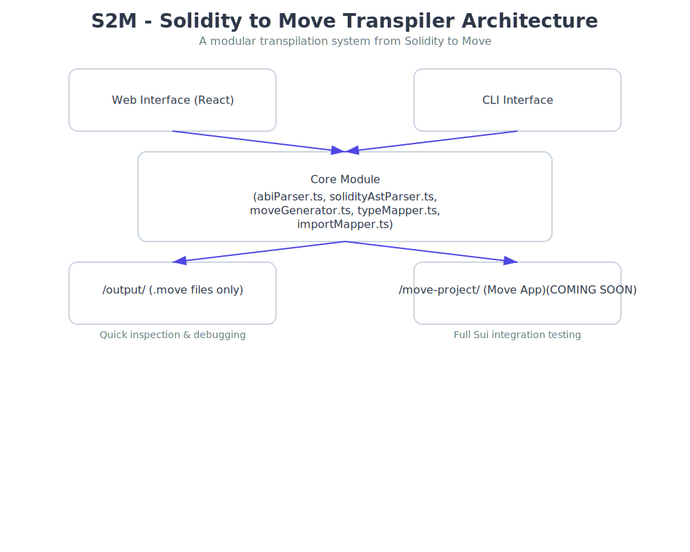

# 🧩 S2M - Architecture Overview

This document outlines the internal architecture of **S2M (Solidity to Move Transpiler)** — a toolchain designed to convert Solidity smart contracts into equivalent **Move** modules for execution on platforms such as **Sui** and **Aptos**.

It serves developers who wish to contribute, debug, or extend the system, and provides an overview of its monorepo structure, module responsibilities, and data flow.

---

## ⚙️ High-Level Architecture

S2M is built as a **monorepo**, providing both CLI and web-based interfaces backed by a shared transpilation engine. The core functionality parses Solidity ABIs (and soon `.sol` files), maps types and functions, and generates compatible Move code.

### 📐 System Scope

| Functionality          | Supported      |
| ---------------------- | -------------- |
| ABI to Move conversion | ✅             |
| Full `.sol` parsing    | 🔜 _(planned)_ |
| Web interface          | ✅             |
| CLI support            | ✅             |
| Move test generation   | ✅             |

---

## 🧱 Modular Architecture Diagram



---

## 📦 Module Breakdown

### 1. `core/` – Transpiler Engine

> Central logic responsible for parsing, type mapping, and Move code generation.

- **`abiParser.ts`**:  
  Converts `.abi.json` definitions into structured AST nodes.

- **`solParser.ts`**: _(Experimental / Optional)_  
  Experimental parser for `.sol` source files to extract contract metadata.

- **`typeMapper.ts`**:  
  Maps Solidity types (`uint256`, `tuple[]`, `address`) to Move equivalents (`u64`, `vector<struct>`, `address`).

- **`moveGenerator.ts`**:  
  Emits valid `.move` module files, public functions, and test scaffolds.

- **`utils/`**:  
  General-purpose helpers for sanitization, deduplication, path handling, etc.

---

### 2. `cli/` – Command-Line Interface

> A minimal wrapper that exposes core functionality via terminal commands.

**Example Usage:**

```bash
cd cli
yarn dev ../examples/MyContract.abi.json MyContract
```

- Accepts: ABI file + contract name
- Outputs:
  - Generated Move module in `/output/`
  - Ready-to-test Move project in `/move-project/`

---

### 3. `web/backend/` – REST API Server

> Backend Express server supporting browser-driven transpilation workflows.

- Endpoints:
  - POST `/transpile` → accepts `.abi.json` uploads
  - Returns generated `.move` file as downloadable response
- Leverages `core/` internally for processing

---

### 4. `web/frontend/` – React-Based UI

> Lightweight web interface for uploading and converting ABIs.

- Built with:
  - Vite + React
  - Tailwind CSS
- Features:
  - File upload for `.abi.json`
  - Contract name input
  - One-click download of resulting Move module

---

### 5. `move-project/` – Auto-Generated Move Project

> Output directory containing a fully scaffolded Move project for testing and deployment.

Structure:

```
move-project/
├── sources/     # Generated .move modules
├── tests/       # Auto-generated test templates
└── Move.toml    # Pre-configured manifest
```

This facilitates seamless integration with tools like `sui move test`.

---

## 🔄 Data Flow & Execution Flow

```txt
┌────────────────────┐
│ User Input:        │
│ - ABI JSON         │
│ - Contract Name    │
└────────┬───────────┘
         ▼
┌────────────────────────┐
│ core/                  │
│ 1. Parses ABI          │
│ 2. Maps Types          │
│ 3. Generates Move Code │
└────────┬───────────────┘
         ▼
┌────────────────────────────┐
│ Output:                    │
│ - /output/*.move           │
│ - /move-project/sources/   │
│ - /move-project/tests/     │
└────────────────────────────┘
         ▼
   🧪 Run Tests: sui move test
```

---

## 🧪 Example Output Mapping

### Solidity ABI Snippet

```json
[
  {
    "name": "getValue",
    "inputs": [],
    "outputs": [{ "type": "uint256" }],
    "type": "function",
    "stateMutability": "view"
  }
]
```

### Corresponding Move Output

```move
public fun get_value(account: &signer): u64 {
    // implementation
}
```

---

## 🛠 Future Roadmap & Extensibility

| Feature                | Status      | Location                      |
| ---------------------- | ----------- | ----------------------------- |
| Event emission support | Planned     | `core/src/eventGenerator.ts`  |
| Full `.sol` parsing    | In Progress | `core/src/solParser.ts`       |
| Interactive Playground | Planned     | `web/frontend/playground.tsx` |
| Move.toml generator    | Implemented | `core/src/configGenerator.ts` |

---

## 💻 Development Toolkit

### 📁 Monorepo Structure

- Uses **Yarn Workspaces** for intra-project communication.
- Shared `core/` ensures consistent behavior between CLI and web interfaces.

### 🧰 Recommended Scripts

```json
// package.json
{
  "scripts": {
    "build:core": "tsc --build core",
    "lint": "eslint . --ext .ts",
    "test:move": "cd move-project && sui move test"
  }
}
```

### 🎯 Target Platforms

- Primary focus: **Sui Move**
- Easily adaptable to **Aptos Move**

---

## 📝 Contribution Guidelines

Please refer to [CONTRIBUTING.md](CONTRIBUTING.md) for details on how to propose changes, submit PRs, and maintain consistency across the codebase.

All contributions must:

- Pass linting and formatting checks
- Include relevant unit tests
- Follow modular design principles

---

## 📄 License

MIT License © 2025 Abdulazeez
